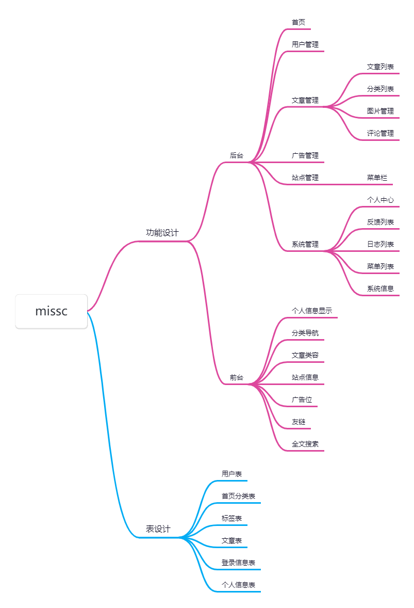

# 如果您喜欢这个开源项目，不妨给它点个⭐️
# 能赞助最好啦!!!!!🙏🙏🙏

## 项目地址

- 交流站：[天兔座α-blog(Arneb)](https://arlog.cn)
- 问题反馈: [https://arlog.cn](https://arlog.cn)
- Gitee: [https://gitee.com/cooting/arlog](https://gitee.com/cooting/arlog)

## 联系作者

# 加我微信

# 打赏

## 付费服务
付费是项目支持,服务器能续期下去，请谅解。项目将一如既往的开源下去~

| 服务     | 价格       | 服务内容                    |
| -------- |----------|-------------------------|
| 商用授权 | ￥888(终生) | 提供"天兔座α-blog"商业使用授权           |
| 付费咨询 | ￥200(一次) | 付费答疑解惑，协助解决问题           |
| 功能定制 | 面议       | 接受各种功能定制，只有你想不到的没有我们做不到的 |

## 介绍 

`天兔座α-blog`是一个使用golang+vue3开源blog系统，采用前后端分离技术，Go语言提供api进行数据支撑，用户页面和后台界面基于element,欢迎一起来交流。

#### 功能排序
- [x] ~~文章模块~~
- [x] ~~分类模块~~
- [x] ~~个人信息~~
- [x] ~~otp认证~~
- [x] ~~用户管理~~
- [ ] 实时搜索
- [ ] 基于内容推荐
- [ ] 广告位推荐
- [ ] 友链推荐
- [ ] 三方登录集成
- [ ] 用户画像
- [ ] 文章排序
- [ ] 实时搜索
- [ ] 用户点赞功能
- [ ] 用户收藏功能
- [ ] 用户端
- [ ] 微信公众号
- [ ] 小程序接入

> go+vue

*技术栈*
- gin 
- gorm 
- jwt
- otp
- logrus
- viper
- vue.js 
- element-ui 

## 功能预览

## 赞助列表

